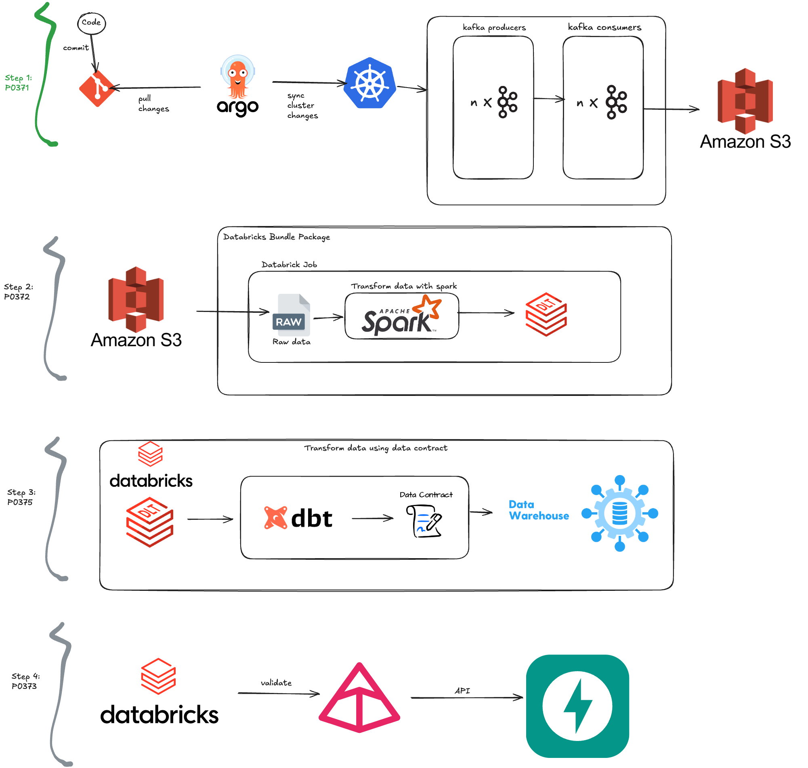
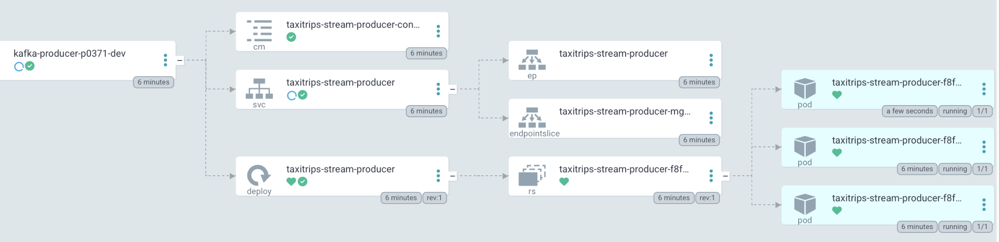
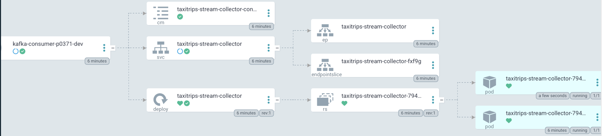
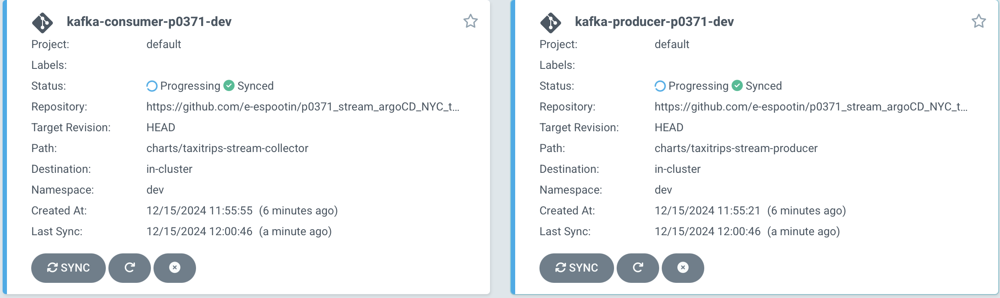

# Streaming Generated TLC Trip Data with Python, Kafka, Kubernetes, ArgoCD into AWS S3

## Project Summary
This project simulates TLC trip data using the Faker library within a containerized environment. It leverages Docker images for both data producers and consumers, which are managed by ArgoCD and deployed on Kubernetes. The Helm configuration file dictates the number of producer and consumer containers. Generated data is continuously streamed and stored in AWS S3. The Kafka server, along with Minikube and ArgoCD, is set up on a local Ubuntu machine to facilitate this process.

## project structure

## ArogCD & kubernetes & kafka

